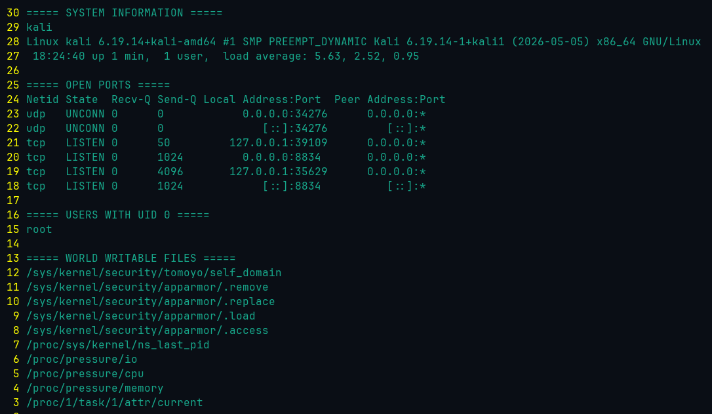

# Linux Security Audit


A lightweight Linux security auditing tool written in Bash.

This project collects basic security information from a Linux host and generates a simple audit report for learning, lab environments, and basic security assessments.

---

## Features

- System information collection
- Hostname and kernel version
- Logged-in user detection
- Disk usage overview
- Memory usage summary
- Open TCP/UDP ports enumeration
- Running services inspection
- Root account verification
- Sudo users identification
- Basic file permission checks
- Report generation

---

## Project Structure

```text
linux-security-audit/
├── .github/
│   └── workflows/
│       └── bash-lint.yml
├── security_audit.sh
├── reports/
│   └── sample_audit_report.txt
├── screenshots/
│   └── sample_output.png
├── .gitignore
├── LICENSE
└── README.md
```

---

## Requirements

- Linux (Ubuntu, Debian, Kali, CentOS, Fedora, etc.)
- Bash
- Standard Linux utilities:
  - uname
  - hostname
  - df
  - free
  - ss (or netstat)
  - systemctl
  - awk
  - grep

### Optional

- ShellCheck (for local linting)

Install ShellCheck on Ubuntu:

```bash
sudo apt update
sudo apt install shellcheck
```

---

## Installation

Clone the repository:

```bash
git clone https://github.com/delgadoroberto/linux-security-audit.git
cd linux-security-audit
```

Make the script executable:

```bash
chmod +x security_audit.sh
```

---

## Usage

Run the audit:

```bash
./security_audit.sh
```

Save the output to a report file:

```bash
./security_audit.sh > reports/audit_report.txt
```

A sample report is available in:

```text
reports/sample_audit_report.txt
```

---

## Continuous Integration

This repository includes a GitHub Actions workflow that automatically:

- Validates Bash syntax
- Runs ShellCheck static analysis

The workflow is executed on every push and pull request to the `main` branch.

Workflow location:

```text
.github/workflows/bash-lint.yml
```

---

## Sample Output

Example terminal output generated by the script:

```text
=================================
      LINUX SECURITY AUDIT
=================================

Hostname: ubuntu-lab
Kernel: 6.8.0

[+] Disk Usage

Filesystem      Size  Used Avail Use%
/dev/sda1        50G   18G   30G  38%

[+] Memory Usage

Total: 8GB
Used : 3GB
Free : 5GB

[+] Open Ports

22/tcp    ssh
80/tcp    nginx

[+] Root Users

root

[+] Sudo Group Members

roberto
```

### Screenshot



A sample generated report is also included:

- `reports/sample_audit_report.txt`

---

## Learning Objectives

This project was created to practice and demonstrate:

- Linux administration
- Bash scripting
- Security auditing fundamentals
- System enumeration techniques
- Security automation concepts
- CI/CD integration with GitHub Actions

---

## Roadmap

Future improvements may include:

- JSON report export
- HTML report generation
- CIS Benchmark checks
- File integrity verification
- Log analysis integration
- Docker container auditing
- Scheduled execution with cron
- Security baseline validation
- Modular plugin architecture

---

## Disclaimer

This tool is intended for educational purposes and authorized security assessments only.

Always obtain proper authorization before auditing systems that you do not own or manage.

---

## License

This project is licensed under the MIT License. See the `LICENSE` file for details.
